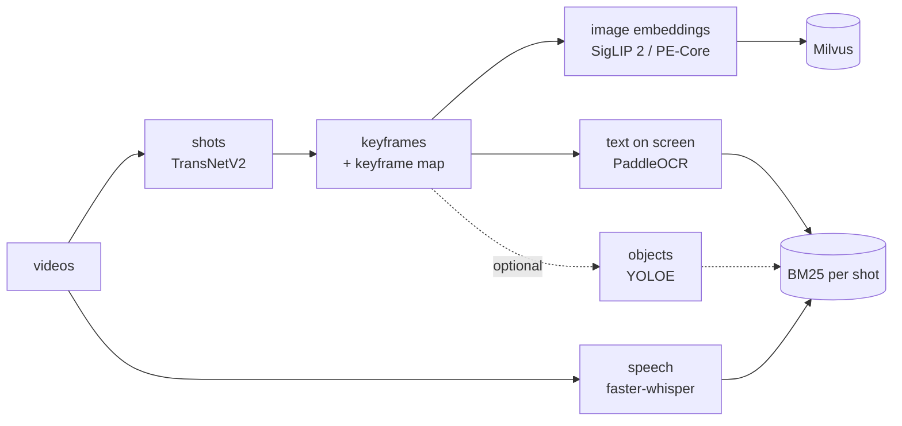
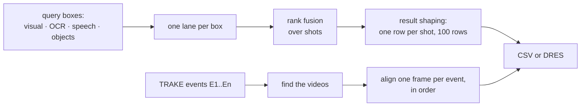

# Video Event Retrieval — HCM AI Challenge 2026

A text-to-video search system for a large collection of Vietnamese videos: news bulletins,
cooking shows, exam lessons, travel, sport and features. Given a description, it finds the
moment described (KIS), the moment that answers a question (Q&A), or a sequence of moments in
the right order (TRAKE), and writes the answer list the organisers score.

This branch documents the whole pipeline and ships it as code you can run. **To try the system,
open the demo:** <https://dinhqhuy7.github.io/HCM-AIChallenge2026-VideoRetrieval/> (the
`system-demo` branch: real queries with results recorded in advance, no model runs in your
browser).

| | |
|---|---|
| [The problem](#the-problem) | what is asked and how answers are scored |
| [Data](#data) | the videos, and where they come from |
| [How it works](#how-it-works) | the offline index and the online search |
| [What is notable](#what-is-notable) | the decisions and lessons that mattered |
| [What was measured, and what was not](#what-was-measured-and-what-was-not) | numbers, with their conditions, and the limits |
| [Technology](#technology) | models and libraries |
| [How to run](#how-to-run) | from videos to a submission file |

## The problem

The collection is 873 Vietnamese videos, 130.7 hours, published on YouTube by news outlets and TV
channels. A query is a Vietnamese description written by the organisers. Three kinds are asked:

| Task | Asked for | One answer row |
|---|---|---|
| **KIS** (Known-Item Search) | a frame inside the described event | `video_id, frame_id` |
| **Q&A** | the event, plus the answer to a question about it | `video_id, frame_id, answer` |
| **TRAKE** (Temporal Retrieval and Alignment of Key Events) | one video, and one frame for each of its events E1…En, in order | `video_id, frame_id_1, …, frame_id_n` |

A KIS or Q&A row is correct when the video matches and `frame_id` falls inside the annotated
range (plus, for Q&A, the answer means the same thing). A TRAKE row scores the fraction of events
whose frame falls inside its range, and zero if the video is wrong. The ranges are short: for
TRAKE, usually under ten frames.

Up to **100 rows** are sent per query. With R@k the best row score among the first *k* rows, the
score of a query is the mean of R@1, R@5, R@20, R@50 and R@100. So the order of the list is the
score: a correct answer at rank 1 earns 1.0, the same answer at rank 35 earns 0.4. The qualifying
round is submitted as CSV files; the live rounds go through a [DRES](https://github.com/dres-dev/DRES)
server, one answer at a time. (The scoring is as the organisers' information document for the round
gives it; read the rules of your own round.)

## Data

The system was developed on the 873 videos the organisers released for the qualifying round:
130.7 hours from seven Vietnamese YouTube channel names, from news bulletins to cooking shows and exam
lessons. The repository holds no video. [data/videos.csv](data/videos.csv) lists them instead, each
with its YouTube link, and the frame rate and frame count of the organisers' copy. Answers are
frame numbers in those copies, so a copy from anywhere else must be checked against the list before
its frame numbers are trusted; `preprocess.py` does this for every listed video. See
[data/README.md](data/README.md).

## How it works

Everything expensive happens once, offline. A query then touches only indexes.





**Offline** ([docs/offline/](docs/offline/README.md))

1. **Shots and keyframes** ([guide](docs/offline/01-shots-and-keyframes.md)). TransNetV2 cuts each
   video into shots. Keyframes are taken inside every shot: the middle frame, or several frames per
   shot. Each keyframe goes into a *keyframe map* that ties picture, frame index and presentation
   time together, so any hit can be traced back to an exact frame and millisecond.
2. **Visual index** ([guide](docs/offline/02-visual-index.md)). Keyframes are embedded with
   SigLIP 2 and/or PE-Core, and the vectors are stored in Milvus: Lite for a small test,
   standalone for a large collection.
3. **Text evidence** ([OCR](docs/offline/03-ocr.md), [speech](docs/offline/04-asr.md)). PaddleOCR
   reads the text on each keyframe; faster-whisper transcribes the speech. Both become one keyword
   document per shot, indexed with BM25. YOLOE object labels can be added the same way.

**Online** ([docs/online.md](docs/online.md), [docs/trake.md](docs/trake.md))

1. A person types the query into up to four boxes: what is **seen**, what is **written** on screen,
   what is **said**, and which **objects** appear. Each box is searched by its own lane.
2. The visual box can be translated from Vietnamese to English first (envit5), for encoders that
   read English.
3. The lanes' rankings are fused by Reciprocal Rank Fusion **over shots**. The fused list is then
   shaped into the rows that are scored: one row per shot, spare frames only after the shots run
   out, at most 100 rows.
4. For TRAKE, each event is searched on its own to find candidate videos. Inside each candidate
   video, the best chain of frames in time order is found by dynamic programming.
5. The rows are written as the CSV the organisers expect, or one row is sent to DRES
   ([docs/submission.md](docs/submission.md)).

## What is notable

Each point is explained, with its reasoning and numbers, in the linked document.

- **Shots, not frames, are ranked and fused.** Fifty frames of one headline are one piece of
  evidence. Ranked as frames, they would outvote fifty different shots.
  → [online.md](docs/online.md#why-shots)
- **Every frame belongs to exactly one shot.** TransNetV2's scene list leaves out the frames of a
  transition, and a frame outside every shot can never be returned. The gaps are filled, and the
  frame count of the shot detector is checked against the decoder's.
  → [01-shots-and-keyframes](docs/offline/01-shots-and-keyframes.md)
- **Time comes from each frame's PTS, not from `index / fps`.** The two disagree on
  variable-frame-rate video: on a test video with 41 frames cut out, frame 100 is at 5,640 ms by its
  timestamp and 4,231 ms by index over the average rate.
- **The OCR model cannot write most accented Vietnamese letters.** The dictionary of
  `PP-OCRv6_medium_rec` holds 23 of the 67 accented lower-case letters: none with a hỏi or a nặng.
  Text is therefore matched with marks removed on both sides, which does not bring back a dropped
  letter. Digits are kept, because a licence plate or a date is often what pins down one frame.
  → [03-ocr](docs/offline/03-ocr.md)
- **Whisper invents speech over music, and `vad_filter` does not make it safe.** With the library
  default, 4 minutes of a news video came out as 8 copies of one "subscribe to the channel" line.
  Silero VAD (shown in the faster-whisper README) gave 55 segments of real speech. On another
  30-second piece, fp16 and fp32 still wrote the invented line with VAD on, and int8 did not.
  → [04-asr](docs/offline/04-asr.md)
- **Speech is joined to shots, not cut at them.** 44.9% of the 115,817 segments of the collection
  span a shot cut; cutting there splits a phrase in two, and a search for it finds neither half.
- **A TRAKE chain is searched as a whole.** On 60 random queries, the best frame of each event
  taken on its own was out of time order in 55, at almost the same total as the ordered chain.
  → [trake.md](docs/trake.md)
- **A later step knows when its input changed.** Re-run preprocessing with other settings, and the
  visual, OCR and object steps redo exactly the videos whose indexed keyframes are no longer the
  ones they were built from. → [offline/](docs/offline/README.md)
- **A library's silence is not a check.** Milvus Lite accepted 5 vectors of 1024 numbers into a
  collection of 1280, because the total divided evenly; the code now checks each vector.
  → [02-visual-index](docs/offline/02-visual-index.md)
- **Every row counts.** KIS and Q&A give each shot one row, and spend a row on a second frame of a
  shot only when no new shot is left.
- **DRES answers have three shapes.** KIS and Q&A carry a time in milliseconds, TRAKE carries frame
  numbers. The client sends one answer per request, refuses to repeat an answer, keeps one it
  never got a reply to as `SENDING`, and reads the verdict out. → [submission.md](docs/submission.md)

## What was measured, and what was not

Measured on one NVIDIA RTX 2080 Ti shared with other jobs, with a quick start run on three
contest videos (a 65-second feature, a 38-second portrait clip and a 4-minute sports commentary):

| Step | Result |
|---|---|
| `preprocess.py` | 65 s of video in 4 s on the GPU, 13 s on 40 CPU cores; same shots both ways |
| `build_index.py visual` | SigLIP 2 at about 29 pictures a second; PE-Core L about 51, bigG about 9 |
| `build_index.py ocr` | about 8 keyframes a second on the GPU, 1 on 40 CPU cores |
| `build_index.py asr` | about ten times real time with `large-v3` in fp16 |
| the whole offline pass on those three videos | 100 s, mostly loading models |
| `search.py` | 15 s from start to finish with SigLIP 2, 18 ms inside a running process |
| tests | 222 pass, 6 skip without a GPU or model |

Not done, and said so:

- **The full collection was not indexed with this code.** The counts for all 873 videos in the
  documents (97,811 shots, 115,817 speech segments) come from an earlier run of the same detector
  and Whisper model, not from this repository's scripts.
- **A clean install was tested for `requirements.txt` and `requirements-objects.txt`, not for
  `requirements-ocr.txt`** (installed from local wheels) **and not for the PyTorch line**
  ([setup.md](docs/setup.md#what-was-tested)).
- **The object lane** was run end to end earlier on two videos; it was not part of the last checks.
- **TRAKE rows share their tails.** One chain is returned per starting keyframe, so inside one video
  the 100 rows differ mostly in the first frame (1 distinct tail in 100 rows on the test index, 11
  with `spread: true`). → [trake.md](docs/trake.md#what-the-100-rows-are-and-are-not)
- **Retrieval quality was not scored.** There is no answer key here, so nothing in this repository
  says how often the right frame comes first. The numbers above are speeds, sizes and behaviours.

## Technology

| Step | Tool | Licence |
|---|---|---|
| Shot boundaries | [TransNetV2](https://github.com/soCzech/TransNetV2) via [transnetv2-pytorch](https://pypi.org/project/transnetv2-pytorch/) | MIT |
| Decoding, timestamps | [PyAV](https://github.com/PyAV-Org/PyAV) (FFmpeg) | BSD-3-Clause |
| Image-text embeddings | [SigLIP 2 so400m](https://huggingface.co/google/siglip2-so400m-patch14-384) (transformers), [PE-Core bigG](https://huggingface.co/timm/PE-Core-bigG-14-448) (OpenCLIP) | Apache-2.0 |
| Vector search | [Milvus](https://milvus.io) 2.5 standalone, or Milvus Lite 2.4 (installed with pymilvus 2.5) | Apache-2.0 |
| Text on screen | [PaddleOCR 3](https://github.com/PaddlePaddle/PaddleOCR), PP-OCRv6 medium | Apache-2.0 |
| Speech | [faster-whisper](https://github.com/SYSTRAN/faster-whisper), Whisper large-v3 | MIT |
| Query translation | [VietAI/envit5-translation](https://huggingface.co/VietAI/envit5-translation) | OpenRAIL |
| Objects (optional) | [Ultralytics YOLOE](https://docs.ultralytics.com/models/yoloe/) | AGPL-3.0 |
| Keyword search, fusion | BM25 and Reciprocal Rank Fusion, in this repository | — |
| Submission | [DRES](https://github.com/dres-dev/DRES) client API v2 | MIT |

Versions, sizes and download commands: [docs/models.md](docs/models.md).

## How to run

The code runs end to end: videos in, a submission file out. The values in `configs/` are the
libraries' own defaults or come from their documentation, with the source beside them. A step with
no published default ships switched off, and the config says how to choose a value. The exception
is `fusion.rrf_k`, which you must set before fusing two or more boxes (the RRF paper uses 60).

```bash
# 1. install (Linux, Python 3.11, FFmpeg, one NVIDIA GPU) -- details in docs/setup.md
python3.11 -m venv .venv && . .venv/bin/activate
pip install torch==2.6.0 torchvision==0.21.0 --index-url https://download.pytorch.org/whl/cu124
pip install -r requirements.txt

# 2. offline: shots, keyframes, vectors, speech (the OCR step runs in its own environment)
python scripts/preprocess.py --videos /path/to/videos --data data
python scripts/build_index.py visual
python scripts/build_index.py asr --videos /path/to/videos
python scripts/build_index.py ocr          # in the OCR environment, see docs/offline/03-ocr.md
python scripts/build_index.py keywords

# 3. online: search, then write the organisers' CSV
python scripts/search.py kis --text "a firefighter carries a child out of a burning house" --out runs/kis-1.csv
python scripts/search.py --query-file query-p1-16-trake.txt --out-dir submission
```

| Read next | |
|---|---|
| [docs/setup.md](docs/setup.md) | environments, GPU, Milvus Lite or standalone |
| [docs/models.md](docs/models.md) | every model: source, licence, size, download |
| [docs/offline/](docs/offline/README.md) | the offline steps, data layout, keyframe map format |
| [docs/online.md](docs/online.md) | query boxes, lanes, fusion, result shaping |
| [docs/trake.md](docs/trake.md) | chain search for TRAKE |
| [docs/submission.md](docs/submission.md) | CSV files for the qualifier, DRES for the live rounds |

Tests: `python -m unittest discover -s tests` (no GPU needed).

## Repository structure

```text
data/           videos.csv (the 873 videos, with YouTube links) · README.md
                -- the scripts write their outputs here too; git ignores them
configs/        preprocess.yaml · index.yaml · search.yaml -- every key explained in place
scripts/        preprocess.py · build_index.py · search.py
src/
  preprocess/        shots, keyframe policies, frame quality, near-duplicate grouping
  embeddings/        one Encoder interface: SigLIP 2, PE-Core
  ocr/               PaddleOCR reader, OCR lines -> shot documents
  asr/               faster-whisper, speech -> shot documents
  object_detection/  YOLOE detector, labels -> shot documents
  retrieval/         Milvus index, BM25, keyword index, lanes, translation, TRAKE, search engine
  fusion/            Reciprocal Rank Fusion, result shaping
  submission/        answer shapes, CSV writer, DRES client
docs/           setup · models · offline/ · online · trake · submission
tests/          unit tests for the logic that runs without a model
```

## Acknowledgements

This work stands on the following models, libraries and papers. Each keeps its own licence.

- TransNetV2: T. Souček and J. Lokoč, *TransNet V2: An effective deep network architecture for
  fast shot transition detection*, arXiv:2008.04838 (MIT); the PyTorch port
  [transnetv2-pytorch](https://github.com/allenday/transnetv2_pytorch) (MIT).
- SigLIP 2: M. Tschannen et al., *SigLIP 2: Multilingual Vision-Language Encoders with Improved
  Semantic Understanding, Localization, and Dense Features*, arXiv:2502.14786 (Apache-2.0).
- Perception Encoder: D. Bolya et al., *Perception Encoder: The best visual embeddings are not at
  the output of the network*, arXiv:2504.13181 (Apache-2.0), loaded through OpenCLIP (G. Ilharco et
  al., doi:10.5281/zenodo.5143773, MIT).
- envit5-translation by VietAI; MTet, arXiv:2210.05610 (OpenRAIL).
- PaddleOCR 3.0 Technical Report, arXiv:2507.05595 (Apache-2.0).
- Whisper: A. Radford et al., *Robust Speech Recognition via Large-Scale Weak Supervision*,
  arXiv:2212.04356 (weights Apache-2.0); faster-whisper and CTranslate2 by SYSTRAN (MIT).
- YOLOE: A. Wang et al., *YOLOE: Real-Time Seeing Anything*, arXiv:2503.07465; Ultralytics
  (AGPL-3.0).
- Milvus and pymilvus (Apache-2.0); PyAV (BSD-3-Clause); Hugging Face transformers (Apache-2.0).
- DRES: L. Sauter et al., *Performance Evaluation in Multimedia Retrieval*, ACM TOMM 2024,
  doi:10.1145/3678881 (MIT).
- G. V. Cormack, C. L. A. Clarke, S. Büttcher, *Reciprocal Rank Fusion outperforms Condorcet and
  individual Rank Learning Methods*, SIGIR 2009.
- S. Robertson and H. Zaragoza, *The Probabilistic Relevance Framework: BM25 and Beyond*, 2009.

The videos belong to their broadcasters and are distributed by the organisers of the HCM AI
Challenge; none are included here.

## License

The code in this repository is released under the [MIT License](LICENSE). The models and libraries
it uses keep their own licences (above). Note that Ultralytics is AGPL-3.0; it is used only by the
optional object step, which runs in its own environment.
