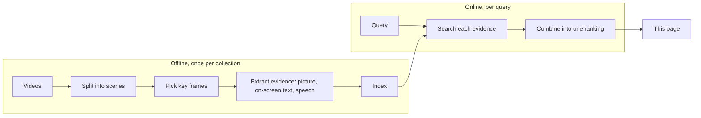
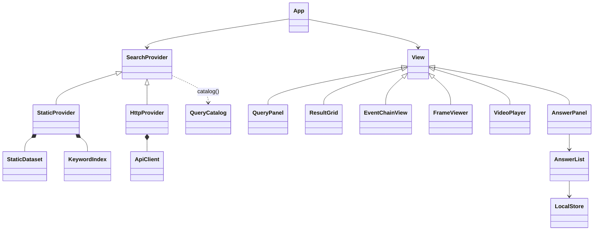

# Architecture

A video retrieval system has three parts. This repository is the third; the
first two are yours to build, and which models they use is your choice.

| Stage | Takes | Produces |
|---|---|---|
| Split into scenes | a video | scene boundaries |
| Pick key frames | a scene | the frames worth indexing, with their times |
| Extract evidence | a frame, or the audio around it | a picture vector, the text on screen, the words spoken |
| Index | all evidence | something each kind of search can query quickly |
| Search each evidence | the query | one ranked list of frames per kind |
| Combine | several ranked lists | one list, best first |

TRAKE asks for several events in order: search each event, then keep chains
of frames from one video whose times follow the events' order.

## The page

The page only displays. Everything it shows comes through one abstract class,
`SearchProvider`; views receive it and never know which subclass they hold.

- `App` builds the provider named in `config.js`, creates the views and routes
  their events (`search`, `open-frame`, `add-answer`, …). No view knows another.
- `capabilities()` tells views which features exist, so no view checks which
  provider it has.
- `core/` holds the plain data (`Frame`, `Video`, `Query`, `Answer`) and the
  Vietnamese text folding shared with the data build.
- Answers are stored per query in the browser and downloaded as the
  competition's CSV: `video,frame` for KIS, `video,frame,answer` for Q&A,
  `video,frame1,frame2,…` for TRAKE.

To plug in your system, implement [the API](api.md); to publish a static demo
of it instead, write [these files](data-format.md).
